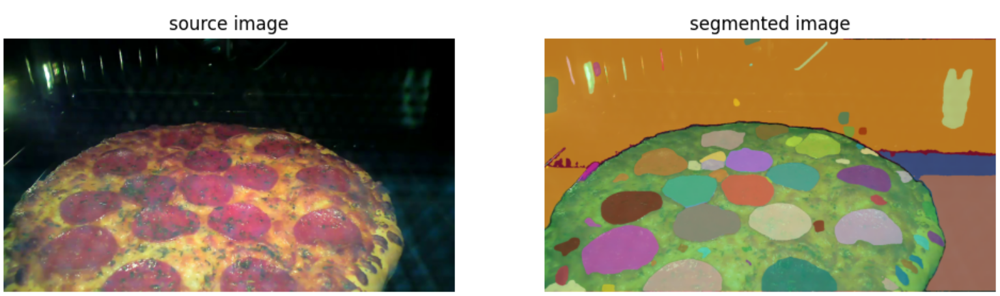

# Pizza-AI-SAM-Model

# Segmenting or masking the required image using Sengment Anything Model released by Meta AI. 

## Segment Anythin:
Segment Anything Model (SAM): a new AI model from Meta AI that can "cut out" any object, in any image, with a single click
SAM is a promptable segmentation system with zero-shot generalization to unfamiliar objects and images, without the need for additional training.

### Software Used
  - SAM
  - Python

### Reason Behind this.
To try and extract the specific part of the image and then use that section for further analysis. 

 ### Screenshots
</td>

